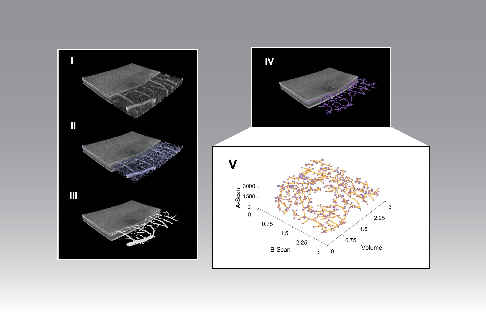

# netGraph
The network graph representation of segmented retinal flow signal patterns is generated.  The number of structural links and nodes corresponding to ETDRS subfieds are provided in table format.  The quantity of links and the quantity of nodes reflect the presence of vasculature segments and their intersections, respectively.<br/> 
The algorithm features the recovery of the appearance of retinal vessels using the projection-resolved (PR) method [1]. An algorithm for the segmentation of retinal blood vessels from fundus images [2] is adapted to OCTA images.  An algorithm for processing a 3D binary voxel skeleton into a network graph described by nodes, endnodes, links and branches [3] was applied to the segmented retinal flow signal.<br/> 
The algorithm is designed to be executed following the execution of 'segPLEX' (https://github.com/cnzakimuena/segPLEX).  Previously processed folders from 'segPLEX' (e.g. for ‘SamplePatient_01’, ‘SamplePatient_02’, etc.) each containing a 'Results' subfolder should be inserted into a 'processed' folder.  The 'processed' folder should be located inside the current directory (sample input dataset: https://www.kaggle.com/cnzakimuena/retinal-oct-and-octa-data-3).<br/> 

[1] M. Zhang et al., "Projection-resolved optical coherence tomographic angiography," Biomedical optics express, vol. 7, no. 3, pp. 816-828, 2016.<br/> 
[2] T. Coye, "A novel retinal blood vessel segmentation algorithm for fundus images. 2015,"ed.<br/> 
[3] M. Kerschnitzki et al., "Architecture of the osteocyte network correlates with bone material quality," Journal of bone and mineral research, vol. 28, no. 8, pp. 1837-1845, 2013.<br/> 

usage:

```matlab
call_netGraph()
```

Cite As

Bélanger Nzakimuena, C. (2020). Automated Analysis of Retinal and Choroidal OCT and OCTA Images in AMD (Masters thesis, Polytechnique Montréal). Retrieved from https://publications.polymtl.ca/5234/


